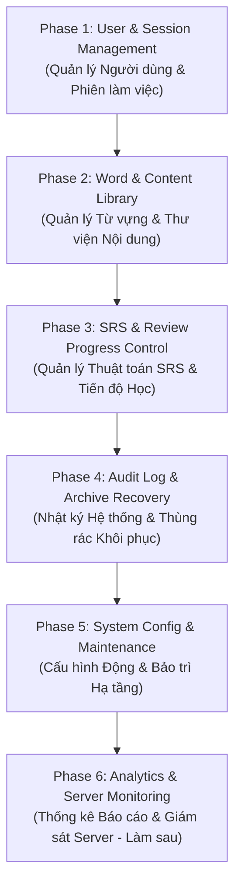

# 🗺️ LexiNote Master Feature Roadmap
## Lộ Trình Phát Triển & Mở Rộng Chức Năng Chi Tiết Từng Module

Tài liệu này tổng hợp **Lộ trình nâng cấp & mở rộng tính năng toàn diện** cho dự án LexiNote (bao gồm Backend API & Dashboard Admin). Tài liệu này dùng làm kim chỉ nam để triển khai từng module theo thứ tự ưu tiên.

---

## 📌 Nguyên Tắc Triển Khai (Core Guidelines)
1. **Ưu tiên tính năng cơ bản trước**: Hoàn thiện các thao tác CRUD quản trị, bảo mật và khôi phục dữ liệu trước khi làm các báo cáo thống kê phức tạp.
2. **Kiến trúc Mô-đun & Reusability**: Tuân thủ nghiêm ngặt việc tách Component nhỏ gọn, sử dụng bộ component tái sử dụng chung (`Pagination`, `PageHeader`, `StatusBadge`, `UserRoleBadge`, `Tooltip`, `ConfirmModal`).
3. **Audit Log Tự Động**: Mọi hành động làm thay đổi dữ liệu của Admin đều phải được tự động ghi vết vào bảng `audit_log`.

---

## 📐 Tổng Quan Các Phase & Module

---

## 🚀 Chi Tiết Lộ Trình Triển Khai Từng Module

### 🔹 Module 1: Quản Lý Người Dùng & Phiên Đăng Nhập (User & Session Management)
*Mục tiêu: Cho phép Admin làm chủ toàn bộ tài khoản người dùng, phân quyền và giám sát an ninh phiên đăng nhập.*

#### 1.1. Core User Management (Backend & Dashboard)
- [x] **Xem danh sách User & Tìm kiếm / Lọc**: Phân trang, tìm kiếm theo tên/email, lọc theo trạng thái (`Active` / `Inactive`).
- [x] **Cấp lại Mật khẩu Mặc định (`123456`)**:
  - API `POST /management/users/:id/reset-password`: Mã hóa bcrypt `123456`, cập nhật DB, thu hồi toàn bộ Refresh Tokens active.
  - Giao diện: Nút Reset Password trên bảng & trong Modal chi tiết kèm cảnh báo `ConfirmModal`.
- [x] **Chỉnh sửa Thông tin cá nhân**: Sửa Họ tên, Email, Role (`ADMIN` / `MEMBER`), Trạng thái (`isActive`).
- [ ] **Khóa & Khôi phục Tài khoản Nâng cao**:
  - Cập nhật lý do khóa tài khoản (`banReason`).
  - Đổi trạng thái tài khoản giữa `active`, `suspended`, `banned`.
- [ ] **Tạo mới User từ Admin (Full Fields)**:
  - Form thêm user cho phép chọn Role (`ADMIN` / `MEMBER`), cài đặt mật khẩu tùy chọn hoặc dùng mặc định `123456`.

#### 1.2. Quản lý Phiên Đăng Nhập & Giám sát Thiết bị (Session Inspector)
- [x] **Xem danh sách phiên active**: IP Address, User-Agent, Trạng thái hết hạn (`isExpired`).
- [x] **Hủy phiên đăng nhập đơn lẻ (`Revoke Session`)**: Hủy token của 1 thiết bị cụ thể.
- [x] **Force Logout All Devices**: Thu hồi toàn bộ Refresh Tokens của User chỉ với 1 click.
- [ ] **Cảnh báo Đăng nhập Bất thường**: Đánh dấu phiên đăng nhập từ IP/Thiết bị lạ.

---

### 🔹 Module 2: Quản Lý Từ Vựng & Thư Viện Nội Dung (Word & Content Management)
*Mục tiêu: Quản lý toàn bộ thư viện từ vựng, từ liên quan và duyệt nội dung đóng góp.*

#### 2.1. Quản lý Từ vựng Toàn diện (Word Master CRUD)
- [x] **Xem & Lọc Từ vựng**: Lọc theo Loại từ (`noun`, `verb`, `adjective`, `adverb`), tìm kiếm từ/nghĩa/ví dụ.
- [x] **Tách riêng các Form Modals**: Tách `WordFormModal`, `WordRelationModal`, `WordImportModal` thành các component độc lập.
- [ ] **Tùy chỉnh Thông tin Từ vựng Nâng cao**:
  - Bổ sung trường phiên âm IPA, Link File Audio phát âm, Thẻ phân loại (Tags/Topics).
  - Chuyển quyền sở hữu từ vựng (`Transfer Word Ownership`) từ User A sang User B.
- [ ] **Quản lý Quan hệ Từ vựng (Word Relations)**:
  - Quản lý từ Đồng nghĩa (`Synonyms`), Trái nghĩa (`Antonyms`), Cụm từ hay đi kèm (`Collocations`).

#### 2.2. Import / Export Hàng Loạt (Bulk Lexical Operations)
- [x] **Export CSV**: Xuất danh sách từ vựng theo trang hoặc theo điều kiện lọc.
- [ ] **Import CSV / JSON Hàng loạt**:
  - Tải lên file CSV chứa danh sách từ vựng.
  - Tự động phát hiện trùng lặp từ (Duplicate Detection) và cho phép ghi đè (Overwrite) hoặc Bỏ qua (Skip).

#### 2.3. Hàng Chờ Duyệt Nội Dung (Moderation Queue)
- [ ] **Duyệt từ vựng đóng góp**: Xem danh sách từ vựng do người dùng đóng góp cho Thư viện cộng đồng.
- [ ] **Xử lý Duyệt**: Nút Duyệt (`Approve`), Yêu cầu sửa đổi (`Request Edit`) hoặc Từ chối (`Reject`) kèm lý do.
- [ ] **Gắn cờ & Báo cáo Vi phạm**: Quản lý từ vựng bị người dùng báo cáo sai nghĩa hoặc nội dung không phù hợp.

---

### 🔹 Module 3: Quản Lý Thuật Toán SRS & Tiến Độ Học Tập (Spaced Repetition System)
*Mục tiêu: Can thiệp và tinh chỉnh các chỉ số ôn tập ngắt quãng của người học.*

#### 3.1. Can thiệp 指数 SRS Thủ công (SRS Tuning)
- [x] **Xem chỉ số SRS trong Inspector**: Hiển thị `easeFactor`, `interval`, `correctCount`, `wrongCount`, `retentionRate`.
- [ ] **Chỉnh sửa chỉ số SRS từng từ vựng**:
  - Đổi ngày lặp tiếp theo (`nextReview`).
  - Đổi độ khó (`easeFactor`) hoặc khoảng thời gian lặp (`interval`).
- [ ] **Reset Tiến độ Học (Reset SRS Progress)**:
  - Đặt lại tiến độ ôn tập về 0 cho 1 từ vựng hoặc toàn bộ thư viện của 1 User.

#### 3.2. Cấu hình Tham số Thuật toán SRS Toàn hệ thống
- [ ] **Cấu hình chỉ số SRS toàn cục**:
  - Cài đặt `initialEaseFactor` (mặc định 2.5), `minEaseFactor` (1.3), `maximumInterval`.

---

### 🔹 Module 4: Nhật Ký Hệ Thống, Bảo Mật & Khôi Phục (Audit Log & Data Security)
*Mục tiêu: Đảm bảo tính minh bạch, lưu vết mọi thao tác Admin và phục hồi dữ liệu khi cần.*

#### 4.1. Tự động Ghi vết Nhật ký Hành động (Audit Trail)
- [x] **Ghi vết tự động các sự kiện chính**: `USER_CREATE`, `USER_UPDATE`, `USER_RESET_PASSWORD`, `USER_DELETE`, `USER_TOGGLE_STATUS`, `USER_UPDATE_ROLE`, `SESSION_REVOKE`.
- [ ] **Nâng cấp Giao diện Audit Log**:
  - Hiển thị So sánh JSON Diff trước & sau khi thay đổi dữ liệu (Before vs After payload).
  - Lọc nhật ký theo Admin Actor, Loại hành động và Khoảng thời gian.

#### 4.2. Thùng Rác & Khôi Phục Dữ Liệu (Archive & Recovery)
- [x] **Giao diện Thùng Rác (`TrashPage.tsx`)**: Xem danh sách các bản ghi bị xóa lưu trong bảng `archive`.
- [x] **1-Click Khôi phục (`Restore Record`)**: Khôi phục dữ liệu từ `archive` về bảng DB gốc.
- [x] **Xóa vĩnh viễn (`Purge Record`)**: Xóa triệt để bản ghi khỏi archive kèm `ConfirmModal`.

---

### 🔹 Module 5: Cấu Hình Động & Bảo Trì Hệ Thống (System Config & Maintenance)
*Mục tiêu: Quản lý hạ tầng và tham số vận hành không cần restart server.*

#### 5.1. Quản lý Cấu hình Động (Dynamic Config API)
- [x] **Lưu & Đồng bộ Cấu hình**: Giới hạn Rate Limit, CORS, Auto Backup, Debug Mode.
- [ ] **Bật/Tắt Chế độ Bảo trì (`Maintenance Mode`)**: Khóa truy cập phía Client App khi bảo trì server.
- [ ] **Bật/Tắt Đăng ký Mới (`Allow New Registration`)**: Tạm dừng cho phép tạo tài khoản mới.

#### 5.2. Công cụ Bảo trì Đột xuất (Maintenance Cleaners)
- [ ] **Dọn dẹp phiên đăng nhập hết hạn**: API 1-click xóa sạch các Refresh Token đã hết hạn trong DB.
- [ ] **Clean Orphaned Records**: Kiểm tra và dọn dẹp các liên kết từ vựng bị mồ côi.

#### 5.3. Chuẩn bị Mailer Service (Email Integration)
- [ ] **Cấu hình SMTP Mailer**: Thêm thiết lập SMTP Server (`host`, `port`, `username`, `password`).
- [ ] **Tự động gửi Email thật khi Reset Password**: Khi Admin bấm reset password, ngoài việc set mật khẩu về `123456`, hệ thống sẽ tự động gửi email thông báo cho User.

---

### 🔹 Module 6: Thống Kê Báo Cáo & Giám Sát Server (Analytics & Monitoring - Làm Sau Cùng)
*Mục tiêu: Cung cấp bức tranh tổng quan về số liệu kinh doanh và sức khỏe hạ tầng.*

#### 6.1. Thống kê Báo cáo Tăng trưởng (Growth Analytics)
- [ ] Biểu đồ người dùng mới theo mốc thời gian (Ngày / Tuần / Tháng).
- [ ] Biểu đồ từ vựng tạo mới và số lượt review SRS toàn hệ thống.
- [ ] Thống kê Top 10 từ vựng khó nhất (được luyện tập nhiều nhất nhưng hay sai).

#### 6.2. Server Health & Database Monitoring
- [ ] Giám sát tình trạng kết nối DB PostgreSQL.
- [ ] Dung lượng RAM / Memory usage và Uptime của Backend Service.

---

## 📌 Bảng Theo Dõi Tiến Độ Thực Hiện

| Module | Tên Module | Trạng thái hiện tại | Bước tiếp theo |
| :---: | :--- | :---: | :--- |
| **Module 1** | User & Session Management | 🟢 85% Hoàn thành | Bổ sung Form Thêm User đầy đủ trường & Khóa tài khoản kèm lý do |
| **Module 2** | Word & Content Library | 🟡 60% Hoàn thành | Bổ sung Phiên âm IPA, Audio URL & Chuyển quyền từ vựng |
| **Module 3** | SRS & Review Progress | 🟡 40% Hoàn thành | Bổ sung API chỉnh sửa `nextReview` & Reset tiến độ SRS 1-click |
| **Module 4** | Audit Log & Archive | 🟢 90% Hoàn thành | Bổ sung hiển thị Before/After JSON diff |
| **Module 5** | System Config & Maintenance | 🟡 50% Hoàn thành | Bổ sung Maintenance Mode & API dọn dẹp Token hết hạn |
| **Module 6** | Analytics & Monitoring | ⏸️ Tạm hoãn (Làm sau) | Sẽ làm sau khi hoàn thiện toàn bộ các Module quản trị ở trên |
