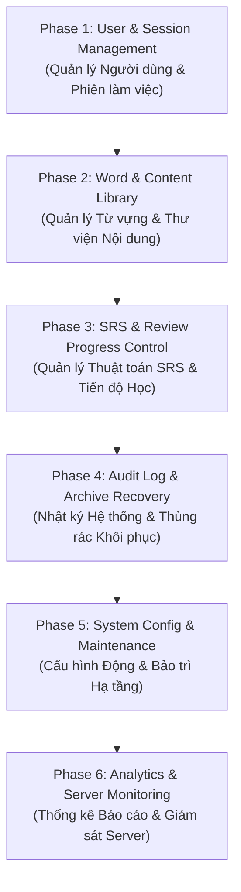

# 🗺️ LexiNote Master Feature Roadmap
## Lộ Trình Phát Triển & Mở Rộng Chức Năng Chi Tiết Từng Module

Tài liệu này tổng hợp **Lộ trình nâng cấp & mở rộng tính năng toàn diện** cho dự án LexiNote (bao gồm Backend API & Dashboard Admin). Tài liệu này dùng làm kim chỉ nam để triển khai từng module theo thứ tự ưu tiên.

> **Cập nhật lần cuối:** 2026-09-27 — Đã đối chiếu với mã nguồn backend, dashboard và client hiện tại.
>
> **Quy ước checklist:** `[x]` hoàn thành đầy đủ; `🟡` đã triển khai một phần; `[ ]` chưa triển khai.

---

## 📌 Nguyên Tắc Triển Khai (Core Guidelines)
1. **Ưu tiên tính năng cơ bản trước**: Hoàn thiện các thao tác CRUD quản trị, bảo mật và khôi phục dữ liệu trước khi làm các báo cáo thống kê phức tạp.
2. **Kiến trúc Mô-đun & Reusability**: Tuân thủ nghiêm ngặt việc tách Component nhỏ gọn, sử dụng bộ component tái sử dụng chung (`Pagination`, `PageHeader`, `StatusBadge`, `UserRoleBadge`, `Tooltip`, `ConfirmModal`).
3. **Audit Log Tự Động**: Mọi hành động làm thay đổi dữ liệu của Admin đều phải được tự động ghi vết vào bảng `audit_log`.

---

## 📐 Tổng Quan Các Phase & Module

```mermaid
flowchart TD
    P1["Phase 1: User & Session Management\n(Quản lý Người dùng & Phiên làm việc)"]
    P2["Phase 2: Word & Content Library\n(Quản lý Từ vựng & Thư viện Nội dung)"]
    P3["Phase 3: SRS & Review Progress Control\n(Quản lý Thuật toán SRS & Tiến độ Học)"]
    P4["Phase 4: Audit Log & Archive Recovery\n(Nhật ký Hệ thống & Thùng rác Khôi phục)"]
    P5["Phase 5: System Config & Maintenance\n(Cấu hình Động & Bảo trì Hạ tầng)"]
    P6["Phase 6: Analytics & Server Monitoring\n(Thống kê Báo cáo & Giám sát Server)"]

    P1 --> P2 --> P3 --> P4 --> P5 --> P6
```

---

## 🚀 Chi Tiết Lộ Trình Triển Khai Từng Module

### 🔹 Module 1: Quản Lý Người Dùng & Phiên Đăng Nhập (User & Session Management)
*Mục tiêu: Cho phép Admin làm chủ toàn bộ tài khoản người dùng, phân quyền và giám sát an ninh phiên đăng nhập.*

#### 1.1. Core User Management (Backend & Dashboard)
- [x] **Xem danh sách User & Tìm kiếm / Lọc**: Phân trang, tìm kiếm theo tên/email, lọc theo trạng thái (`Active` / `Inactive`).
- [x] **Cấp lại Mật khẩu Mặc định (`123456`)**:
  - API `POST /management/users/:id/reset-password`: Mã hóa bcrypt `123456`, cập nhật DB, thu hồi toàn bộ Refresh Tokens active.
  - Giao diện: Nút Reset Password trên bảng & trong Modal chi tiết kèm cảnh báo `ConfirmModal`.
- [x] **Chỉnh sửa Thông tin cá nhân**: Sửa Họ tên, Email, Role (`ADMIN` / `MEMBER`), Trạng thái (`isActive`).
- [x] **Khóa & Khôi phục Tài khoản Nâng cao**:
  - API `POST /management/users/:id/ban` lưu `banReason`, đặt `status=banned`, tắt tài khoản và thu hồi toàn bộ refresh sessions.
  - API `POST /management/users/:id/unban` khôi phục `status=active`, bật tài khoản và xóa `banReason`.
- [x] **Tạo mới User từ Admin (Full Fields)**:
  - Backend và Dashboard hỗ trợ `fullName`, `email`, password tùy chọn và role (`ADMIN` / `MEMBER`), mặc định mật khẩu `123456` và role `MEMBER`.

#### 1.2. Quản lý Phiên Đăng Nhập & Giám sát Thiết bị (Session Inspector)
- [x] **Xem danh sách phiên active**: IP Address, User-Agent, Trạng thái hết hạn (`isExpired`).
- [x] **Hủy phiên đăng nhập đơn lẻ (`Revoke Session`)**: Hủy token của 1 thiết bị cụ thể.
- [x] **Force Logout All Devices**: Thu hồi toàn bộ Refresh Tokens của User chỉ với 1 click.
- [ ] **Cảnh báo Đăng nhập Bất thường**: Đánh dấu phiên đăng nhập từ IP/Thiết bị lạ.

---

### 🔹 Module 2: Quản Lý Từ Vựng & Thư Viện Nội Dung (Word & Content Management)
*Mục tiêu: Quản lý toàn bộ thư viện từ vựng, từ liên quan và duyệt nội dung đóng góp.*

#### 2.1. Quản lý Từ vựng Toàn diện (Word Master CRUD)
- [x] **Xem & Lọc Từ vựng**: Lọc theo Loại từ (`noun`, `verb`, `adjective`, `adverb`), tìm kiếm từ/nghĩa/ví dụ.
- [x] **Tách riêng các Form Modals**: Tách `WordFormModal`, `WordRelationModal`, `WordImportModal` thành các component độc lập.
- [ ] **Tùy chỉnh Thông tin Từ vựng Nâng cao**:
  - Bổ sung trường phiên âm IPA, Link File Audio phát âm, Thẻ phân loại (Tags/Topics).
  - Chuyển quyền sở hữu từ vựng (`Transfer Word Ownership`) từ User A sang User B.
- [x] **Quản lý Quan hệ Từ vựng (Word Relations) cơ bản**:
  - Dashboard/API đã hỗ trợ thêm và xóa relation theo loại/value; có thể dùng cho `Synonyms`, `Antonyms` và `Collocations`.
  - Chưa có các tính năng nâng cao như chỉnh sửa relation hoặc kiểm tra trùng lặp.

#### 2.2. Import / Export Hàng Loạt (Bulk Lexical Operations)
- [x] **Export CSV**: Xuất danh sách từ vựng theo trang hoặc theo điều kiện lọc.
- 🟡 **Import hàng loạt dạng raw text**:
  - Backend đã nhận danh sách từ dạng text, phân tách bằng dấu phẩy/chấm phẩy/xuống dòng, phát hiện trùng lặp và bỏ qua từ đã tồn tại.
  - Chưa có upload file CSV/JSON và lựa chọn ghi đè (`Overwrite`) hoặc bỏ qua (`Skip`) ở cấp file.

#### 2.3. Hàng Chờ Duyệt Nội Dung (Moderation Queue)
- [x] **Duyệt từ vựng đóng góp cơ bản**: Dashboard/API đã có danh sách pending, lọc, tìm kiếm và phân trang.
- 🟡 **Xử lý Duyệt**: Đã có Duyệt (`Approve`) và Duyệt hàng loạt (`Batch Approve`); chưa có `Request Edit` hoặc `Reject` kèm lý do.
- [ ] **Gắn cờ & Báo cáo Vi phạm**: Chưa có luồng báo cáo từ phía người dùng và màn hình xử lý báo cáo.

---

### 🔹 Module 3: Quản Lý Thuật Toán SRS & Tiến Độ Học Tập (Spaced Repetition System)
*Mục tiêu: Can thiệp và tinh chỉnh các chỉ số ôn tập ngắt quãng của người học.*

#### 3.1. Can thiệp chỉ số SRS Thủ công (SRS Tuning)
- [x] **Xem chỉ số SRS trong Inspector**: Hiển thị `easeFactor`, `interval`, `correctCount`, `wrongCount`, `retentionRate`.
- [ ] **Chỉnh sửa chỉ số SRS từng từ vựng**:
  - Đổi ngày lặp tiếp theo (`nextReview`).
  - Đổi độ khó (`easeFactor`) hoặc khoảng thời gian lặp (`interval`).
- [ ] **Reset Tiến độ Học (Reset SRS Progress)**:
  - Đặt lại tiến độ ôn tập về 0 cho 1 từ vựng hoặc toàn bộ thư viện của 1 User.

#### 3.2. Cấu hình Tham số Thuật toán SRS Toàn hệ thống
- [ ] **Cấu hình chỉ số SRS toàn cục**:
  - Cài đặt `initialEaseFactor` (mặc định 2.5), `minEaseFactor` (1.3), `maximumInterval`.

---

### 🔹 Module 4: Nhật Ký Hệ Thống, Bảo Mật & Khôi Phục (Audit Log & Data Security)
*Mục tiêu: Đảm bảo tính minh bạch, lưu vết mọi thao tác Admin và phục hồi dữ liệu khi cần.*

#### 4.1. Tự động Ghi vết Nhật ký Hành động (Audit Trail)
- [x] **Ghi vết tự động các sự kiện chính**: `USER_CREATE`, `USER_UPDATE`, `USER_RESET_PASSWORD`, `USER_DELETE`, `USER_TOGGLE_STATUS`, `USER_UPDATE_ROLE`, `SESSION_REVOKE`.
- [ ] **Nâng cấp Giao diện Audit Log**:
  - Hiển thị So sánh JSON Diff trước & sau khi thay đổi dữ liệu (Before vs After payload).
  - Lọc nhật ký theo Admin Actor, Loại hành động và Khoảng thời gian.

#### 4.2. Thùng Rác & Khôi Phục Dữ Liệu (Archive & Recovery)
- [x] **Giao diện Thùng Rác (`TrashPage.tsx`)**: Xem danh sách các bản ghi bị xóa lưu trong bảng `archive`.
- [x] **1-Click Khôi phục (`Restore Record`)**: Khôi phục dữ liệu từ `archive` về bảng DB gốc.
- [x] **Xóa vĩnh viễn (`Purge Record`)**: Xóa triệt để bản ghi khỏi archive kèm `ConfirmModal`.

---

### 🔹 Module 5: Cấu Hình Động & Bảo Trì Hệ Thống (System Config & Maintenance)
*Mục tiêu: Quản lý hạ tầng và tham số vận hành không cần restart server.*

#### 5.1. Quản lý Cấu hình Động (Dynamic Config API)
- 🟡 **Hiển thị và cập nhật cấu hình hệ thống**: API/config page đã có thông tin environment, CORS, rate limit và database health.
  - Hiện `updateConfig()` mới trả về dữ liệu và ghi log, chưa lưu cấu hình vào database/environment; `autoBackup` và `debugMode` chưa có triển khai thực tế.
- [ ] **Bật/Tắt Chế độ Bảo trì (`Maintenance Mode`)**: Khóa truy cập phía Client App khi bảo trì server.
- [ ] **Bật/Tắt Đăng ký Mới (`Allow New Registration`)**: Tạm dừng cho phép tạo tài khoản mới.

#### 5.2. Công cụ Bảo trì Đột xuất (Maintenance Cleaners)
- [ ] **Dọn dẹp phiên đăng nhập hết hạn**: API 1-click xóa sạch các Refresh Token đã hết hạn trong DB.
- [ ] **Clean Orphaned Records**: Kiểm tra và dọn dẹp các liên kết từ vựng bị mồ côi.

#### 5.3. Mailer Service (Email Integration)
- [x] **Cấu hình SMTP/Brevo Mailer**: Mail service đã hỗ trợ Brevo HTTPS API và SMTP fallback qua biến môi trường.
- [x] **Tự động gửi Email khi Reset Password**: Admin reset password sẽ đặt lại mật khẩu, thu hồi session và gửi email thông báo cho User.

---

### 🔹 Module 6: Thống Kê Báo Cáo & Giám Sát Server (Analytics & Monitoring)
*Mục tiêu: Cung cấp bức tranh tổng quan về số liệu kinh doanh và sức khỏe hạ tầng.*

#### 6.1. Thống kê Báo cáo Tăng trưởng (Growth Analytics)
- 🟡 **Analytics summary/chart/activity**: Dashboard và API đã có tổng số user, từ vựng, review, active sessions, retention, hardest words, hoạt động gần đây và chart theo `7d/30d/90d/1y`.
- 🟡 **Biểu đồ người dùng mới**: Chart hiện theo dõi active users, từ mới và số lượt review; chưa có chuỗi `new users` thực tế theo thời gian.
- [x] **Biểu đồ từ vựng tạo mới và số lượt review SRS**.
- 🟡 **Từ vựng khó**: Đã có danh sách `hardestWords`, nhưng backend hiện trả Top 5 thay vì Top 10.

#### 6.2. Server Health & Database Monitoring
- [x] **Giám sát kết nối DB PostgreSQL cơ bản**: Config API thực hiện `SELECT 1` và trả về trạng thái database; health endpoint trả về uptime.
- 🟡 **Uptime và tài nguyên server**: Uptime đã có ở health endpoint, nhưng chưa có số liệu RAM/Memory thực tế; `activeConnections` trong config hiện vẫn là giá trị mock.

---

## 📌 Bảng Theo Dõi Tiến Độ Thực Hiện

| Module | Tên Module | Trạng thái hiện tại | Bước tiếp theo |
| :---: | :--- | :---: | :--- |
| **Module 1** | User & Session Management | 🟢 100% Core Complete | Hoàn tất Core User Management (Add Member full fields, Ban with reason, Unban, Session Revoke). Chuẩn bị đợt 2 (Module 2 Moderation). |
| **Module 2** | Word & Content Library | 🟡 Khoảng 70% | Bổ sung IPA/audio/tags, transfer ownership, file import và moderation reject/request-edit |
| **Module 3** | SRS & Review Progress | 🟡 Khoảng 30% | Bổ sung API chỉnh sửa `nextReview`, tuning SRS và reset tiến độ 1-click |
| **Module 4** | Audit Log & Archive | 🟢 Khoảng 80% | Bổ sung Before/After JSON diff và lọc theo khoảng thời gian |
| **Module 5** | System Config & Maintenance | 🟡 Khoảng 45% | Lưu config thực tế, Maintenance Mode, dọn token hết hạn và orphan records |
| **Module 6** | Analytics & Monitoring | 🟡 Đã có nền tảng | Bổ sung new-user time series, Top 10 hardest words và memory monitoring |
