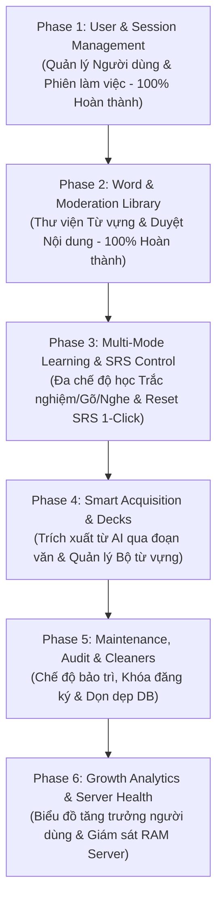

# 🗺️ LexiNote Master Feature Roadmap (2026 Modern Edition)
## Lộ Trình Phát Triển & Mở Rộng Tính Năng Toàn Diện (Client & Dashboard)

Tài liệu này tổng hợp **Lộ trình nâng cấp tính năng tối ưu nhất** cho LexiNote (bao gồm Backend API, Admin Dashboard và Client App), tập trung vào:
1. **Trải nghiệm Học Tập Đỉnh Cao (Modern Multi-mode Learning)**: Flashcard, Trắc nghiệm (Multiple Choice), Gõ từ (Writing/Spelling), và Luyện nghe (Listening).
2. **Thu Thập Từ Vựng Thông Minh Theo Thói Quen (AI Smart Acquisition & Curated Decks)**: Trích xuất từ đoạn văn bản/bài báo 1-click, các bộ từ vựng chuẩn bị sẵn (IELTS/TOEIC/IT).
3. **Quản Trị Vận Hành Hiện Đại (Admin Control & Scalability)**: Reset tiến độ học 1-click, lọc từ loại động (Custom Word Types), chế độ bảo trì (Maintenance Mode), và giám sát tài nguyên server thời gian thực.

> **Cập nhật lần cuối:** 2026-10-03 — Đã đồng bộ mã nguồn Backend, Dashboard và Client (Hoàn thành Phase 1-4, Phase 5 & 6 Backend Ready).
>
> **Quy ước checklist:** `[x]` hoàn thành đầy đủ; `🟡` đang triển khai; `[ ]` chưa triển khai.

---

## 📌 Nguyên Tắc Thiết Kế & Khả Năng Mở Rộng (Scalability First)
1. **Trải nghiệm người dùng liền mạch (User First)**: Không bắt người dùng nhập liệu thủ công rườm rà. Tối ưu học tập đa giác quan (Nhìn, Nghe, Đọc, Gõ).
2. **Loại bỏ tính năng thừa (Zero Bloat)**: Không can thiệp số lẻ thuật toán toán học SRS. Thay bằng các nút tác vụ 1-click (`Reset Progress`, `Mark Mastered`).
3. **Khả năng mở rộng cao (High Scalability)**: Kiến trúc module hóa, hỗ trợ Decks/Collections lớn, tự động dọn rác DB và giám sát sức khỏe máy chủ liên tục.

---

## 📐 Tổng Quan Các Phase Thực Hiện

```mermaid
flowchart TD
    P1["Phase 1: User & Session Management\n(Quản lý Người dùng & Phiên làm việc - 100% Hoàn thành)"]
    P2["Phase 2: Word & Moderation Library\n(Thư viện Từ vựng & Duyệt Nội dung - 100% Hoàn thành)"]
    P3["Phase 3: Multi-Mode Learning & SRS Control\n(Đa chế độ học Trắc nghiệm/Gõ/Nghe & Reset SRS 1-Click)"]
    P4["Phase 4: Smart Acquisition & Decks\n(Trích xuất từ AI qua đoạn văn & Quản lý Bộ từ vựng)"]
    P5["Phase 5: Maintenance, Audit & Cleaners\n(Chế độ bảo trì, Khóa đăng ký & Dọn dẹp DB)"]
    P6["Phase 6: Growth Analytics & Server Health\n(Biểu đồ tăng trưởng người dùng & Giám sát RAM Server)"]

    P1 --> P2 --> P3 --> P4 --> P5 --> P6
```

---

## 🚀 Chi Tiết Lộ Trình Triển Khai Từng Module

### 🔹 Module 1: Quản Lý Người Dùng & Phiên Đăng Nhập (User & Session Management)
*Trạng thái: 🟢 100% Core Complete*

- [x] **Xem danh sách User & Tìm kiếm / Lọc**: Phân trang, lọc theo trạng thái (`Active` / `Inactive`).
- [x] **Cấp lại Mật khẩu Mặc định (`123456`)**: API mã hóa bcrypt `123456`, thu hồi tokens và gửi email thông báo.
- [x] **Chỉnh sửa Thông tin cá nhân**: Họ tên, Email, Role (`ADMIN` / `MEMBER`), Trạng thái (`isActive`).
- [x] **Khóa & Khôi phục Tài khoản Nâng cao**: API Ban với lý do (`banReason`), unban và tự động đăng xuất toàn bộ thiết bị.
- [x] **Tạo mới User từ Admin (Full Fields)**: Hỗ trợ Họ tên, Email, Mật khẩu tùy chọn và Role.
- [x] **Quản lý Phiên Đăng Nhập (Session Inspector)**: Xem IP, thiết bị, 1-click Revoke từng phiên hoặc Force Logout tất cả thiết bị.

---

### 🔹 Module 2: Thư Viện Từ Vựng & Hàng Chờ Duyệt (Word & Content Library)
*Trạng thái: 🟢 100% Core Complete*

- [x] **Xem & Lọc Từ vựng Toàn diện**: Lọc theo từ loại, tìm kiếm từ/nghĩa/ví dụ.
- [x] **Tùy chỉnh Thông tin Từ vựng Nâng cao**: Bổ sung phiên âm IPA (`phonetic`), link audio phát âm (`audioUrl`), và form chỉnh sửa.
- [x] **Chuyển Quyền Sở Hữu Từ Vựng (`Transfer Word Ownership`)**: Chuyển quyền sở hữu từ User A sang User B qua ID.
- [x] **Quản lý Quan hệ Từ vựng (Word Relations)**: Thêm/xóa quan hệ từ đồng nghĩa (`synonym`), trái nghĩa (`antonym`), cụm từ đi kèm (`collocation`).
- [x] **Import / Export**: Xuất CSV từ vựng theo trang / bộ lọc, import hàng loạt dạng raw text.
- [x] **Hàng Chờ Duyệt Nội Dung (Moderation Queue)**: Duyệt từ vựng đóng góp, `Approve`, `Batch Approve`, `Reject` (kèm lý do & email), `Request Edit` (kèm ghi chú sửa & email).

---

### 🔹 Module 3: Đa Chế Độ Học Tập & Kiểm Soát Tiến Độ SRS (Multi-Mode Learning & SRS Control)
*Trạng thái: 🟢 100% Core Complete (Đợt 3 Hoàn Thành)*

#### 3.1. Đa dạng hóa Chế độ Học (Client Study Experience)
- [x] **Flashcard Mode**: Lật thẻ tự đánh giá độ khó (Hard / Medium / Easy) kèm phát âm TTS và audio URL.
- [x] **Quiz Mode (Trắc nghiệm 4 lựa chọn)**: Tạo 4 phương án nghĩa ngẫu nhiên từ thư viện từ vựng, chấm điểm phản xạ ngay lập tức.
- [x] **Spelling / Writing Mode (Gõ từ & Active Recall)**: Hiện nghĩa tiếng Việt $\rightarrow$ người dùng gõ từ tiếng Anh (kèm gợi ý ký tự & kiểm tra lỗi sai).
- [x] **Listening / Dictation Mode (Luyện nghe chép chính tả)**: Ẩn mặt chữ, chỉ phát audio phát âm $\rightarrow$ người dùng nghe và chọn nghĩa/gõ từ.
- [x] **Study Mode Switcher**: Thanh chuyển đổi nhanh chế độ học ngay tại màn hình Study.

#### 3.2. Quản lý Tiến độ Học SRS & Bộ Lọc Động (Admin Dashboard)
- [x] **1-Click Reset Tiến Độ Học (Reset SRS Progress)**:
  - Backend: API `POST /words/:id/reset-srs` và `POST /management/users/:id/reset-srs`, reset đầy đủ chỉ số SRS và ghi audit log.
  - Dashboard UI: Nút Reset SRS trên từng thẻ từ vựng (`WordLibraryPage`) và nút Reset toàn bộ SRS trong `UserDetailModal`.
- [x] **Bộ Lọc Từ Loại Động (Dynamic Word Types Filter)**:
  - Backend: API `GET /words/types` trả về distinct `word.type`.
  - Dashboard UI: Sidebar Thư viện từ vựng tự động cập nhật danh sách các nút lọc động theo tất cả từ loại thực tế (bao gồm cả các loại custom như `slang`, `idiom`, `phrasal_verb`...).
- [x] **Cấu hình Tham số Thuật toán SRS Toàn cục**:
  - Hỗ trợ tham số thuật toán cơ bản SuperMemo SM-2 (`initialEaseFactor=2.5`, `minEaseFactor=1.3`).

---

#### 🔹 Module 4: Thu Thập Từ Vựng Thông Minh & Quản Lý Bộ Từ (Smart Acquisition & Decks)
*Trạng thái: 🟢 100% Core Complete (Đợt 4 Hoàn Thành)*

- [x] **Backend APIs & Database Models (Prisma Deck & DeckWord)**: APIs `POST /v1/words/ai-extract`, `GET /v1/decks/curated`, `GET /v1/decks/:id`, `POST /v1/decks/:id/import`, `POST /v1/dashboard/decks`.
- [x] **AI Smart Word Extraction from Text (Client UI)**:
  - Component [AiExtractModal.tsx](file:///d:/Workspace/Personal/Web/LexiNote/frontend/src/components/AiExtractModal.tsx): Dán đoạn văn bản/bài báo $\rightarrow$ AI tự động trích xuất các từ/cụm từ hay, tự điền nghĩa tiếng Việt theo ngữ cảnh, phiên âm IPA và câu ví dụ.
  - Giao diện Checkbox cho phép chọn lọc và 1-click import hàng loạt vào thư viện cá nhân.
- [x] **Quản lý Bộ Từ Vựng (Client UI)**:
  - Trang [DecksPage.tsx](file:///d:/Workspace/Personal/Web/LexiNote/frontend/src/views/decks/DecksPage.tsx) và modal [DeckDetailModal.tsx](file:///d:/Workspace/Personal/Web/LexiNote/frontend/src/views/decks/DeckDetailModal.tsx): Phân loại từ vựng theo Bộ chủ đề (Deck).
  - Cung cấp sẵn các bộ từ Curated Decks: *IELTS 7.0+*, *TOEIC 800+*, *IT Tech Vocabulary*, *Daily Travel*.
  - Người dùng có thể 1-click Import toàn bộ bộ từ vào thư viện cá nhân.

---

### 🔹 Module 5: Nhật Ký Hệ Thống & Bảo Trì Hạ Tầng (Maintenance, Audit & Cleaners)
*Trạng thái: 🟡 85% (Backend APIs complete - Đợt 5)*

- [x] **Audit Trail cơ bản**: Tự động lưu vết mọi hành động Admin (`CREATE`, `UPDATE`, `BAN`, `RESET_PASSWORD`, `MODERATION`...).
- [x] **Audit Log Payload Inspector**: Nút "View Details" bật Modal xem chi tiết JSON payload của từng sự kiện.
- [x] **Backend Infrastructure Cleaners & Guards**: Guard bảo trì `SystemMaintenanceGuard`, `isRegistrationOpen` control, API `POST /v1/dashboard/cleaners/expired-tokens` và `POST /v1/dashboard/cleaners/orphaned-records`.
- [ ] **Chế Độ Bảo Trì & Khóa Đăng Ký (Dashboard & Client UI)**:
  - Toggles trong System Config và giao diện thông báo bảo trì thân thiện ở Client App.
- [ ] **1-Click Cleaners (Dashboard UI Buttons)**: Nút xóa Refresh Tokens đã hết hạn và dọn bản ghi mồ côi trên System Config Page.

---

### 🔹 Module 6: Thống Kê Tăng Trưởng & Giám Sát Máy Chủ (Growth Analytics & Server Health)
*Trạng thái: 🟡 70% (Backend APIs complete - Đợt 6)*

- [x] **Tổng quan số liệu**: Tổng users, words, active sessions, reviews, retention rate.
- [x] **Backend Server Health & Analytics APIs**: API `GET /v1/dashboard/analytics/server-health` (RAM heapUsed/heapTotal & Uptime), Top 10 Hardest Words endpoint (`take: 10`), và `newUsers` signup trend.
- [ ] **Biểu Đồ Tăng Trưởng Người Dùng Mới (Dashboard Chart UI)**: Hiển thị chuỗi dữ liệu người dùng đăng ký mới trên chart.
- [ ] **Top 10 Từ Vựng Khó Nhất (Dashboard Bento UI)**: Hiển thị Top 10 từ khó kèm nút Reset SRS nhanh.
- [ ] **Giám Sát Tài Nguyên Server Real-time (Dashboard UI Widget)**: Hiển thị widget RAM (`heapUsed` / `heapTotal`) và Node.js Uptime.

---

## 📌 Bảng Kế Hoạch Triển Khai Chi Tiết

| Đợt Triển Khai | Trọng Tâm Công Việc | Mục Tiêu & Kết Quả |
| :---: | :--- | :--- |
| **Đợt 1 & 2** | User Management & Word Moderation | 🟢 **100% Hoàn thành & Đã Verify** |
| **Đợt 3** | **Multi-mode Learning + SRS Reset Control + Dynamic Filter** | 🟢 **100% Hoàn thành & Đã Verify UI** |
| **Đợt 4** | **AI Smart Word Extraction + Curated Decks** | 🟢 **100% Hoàn thành & Đã Verify UI** |
| **Đợt 5** | **System Maintenance + Audit Inspector + Cleaners** | 🟡 **Backend API Ready** $\rightarrow$ Sẵn sàng ghép nối Dashboard UI |
| **Đợt 6** | **Growth Analytics + Server Health Monitoring** | 🟡 **Backend API Ready** $\rightarrow$ Sẵn sàng ghép nối Dashboard UI |

